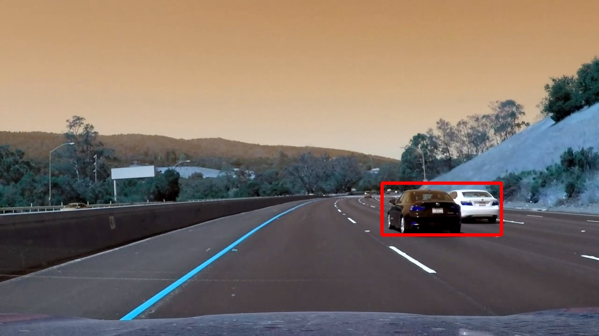

## Writeup 
**Vehicle Detection Project**

The goals / steps of this project are the following:

* Perform a Histogram of Oriented Gradients (HOG) feature extraction on a labeled training set of images and train a classifier SVM classifier
* Optionally, you can also apply a color transform and append binned color features, as well as histograms of color, to your HOG feature vector. 
* Note: for those first two steps don't forget to normalize your features and randomize a selection for training and testing.
* Implement a sliding-window technique and use your trained classifier to search for vehicles in images.
* Run your pipeline on a video stream (start with the test_video.mp4 and later implement on full project_video.mp4) and create a heat map of recurring detections frame by frame to reject outliers and follow detected vehicles.
* Estimate a bounding box for vehicles detected.

## [Rubric](https://review.udacity.com/#!/rubrics/513/view) Points
### Here I will consider the rubric points individually and describe how I addressed each point in my implementation.  

---
### Histogram of Oriented Gradients (HOG)

#### 1. Explain how (and identify where in your code) you extracted HOG features from the training images.

The code for this step is contained in the `training.py` file. The `lesson_functions.py` contains all functions used by the `training.py` script. 

I started by reading in all the `vehicle` and `non-vehicle` images.  Here is an example of one of each of the `vehicle` and `non-vehicle` classes:


|  |  |
| --------------------- | ------------------------- |
| Car                   | Not a car                 |

I then explored different color spaces and different `skimage.hog()` parameters (`orientations`, `pixels_per_cell`, and `cells_per_block`).  I grabbed random images from each of the two classes and displayed them to get a feel for what the `skimage.hog()` output looks like.

Here is an example using the `R` color channel and HOG parameters of `orientations=8`, `pixels_per_cell=(8, 8)` and `cells_per_block=(2, 2)`:

|  |  |
| ------------------------- | ----------------------------- |
| Car hog                   | Not car hog                   |

#### 2. Explain how you settled on your final choice of HOG parameters.

The following HOG parameters are chosen for the vehicle classifier. 

```python
color_space = 'YCrCb' # Can be RGB, HSV, LUV, HLS, YUV, YCrCb
orient = 8  # HOG orientations
pix_per_cell = 8 # HOG pixels per cell
cell_per_block = 1 # HOG cells per block
hog_channel = 0 # Can be 0, 1, 2, or "ALL"
spatial_size = (8, 8) # Spatial binning dimensions
hist_bins = 16    # Number of histogram bins
spatial_feat = True # Spatial features on or off
hist_feat = True # Histogram features on or off
hog_feat = True # HOG features on or off

```

Because, according to the series of testing in the following, the classification accuracy has been larger than 99.5%. There is not much space to improve. But the choice of 8 pixels per cell and 1 cell per block greatly reduced the feature length and the time cost in training. 

| Color space | Orient | Pixel /cell | Cell  /block | spat feat | hist feat | hog feat | Feat length | Seconds to train | Accu racy |
| ----------- | ------ | ----------- | ------------ | --------- | --------- | -------- | ----------- | ---------------- | --------- |
| YCrCb       | 8      | 8           | 1            | True      | True      | True     | 728         | 0.19             | 0.995     |
| RGB         |        |             |              |           |           |          | 728         | 0.21             | 0.965     |
|             | 16     |             |              |           |           |          | 1240        | 0.28             | 0.98      |
|             |        | 4           |              |           |           |          | 2264        | **0.93**         | 0.955     |
|             |        |             | 2            |           |           |          | 1784        | 0.29             | 0.995     |
|             |        |             |              | False     |           |          | 536         | 0.22             | **0.795** |
|             |        |             |              |           | False     |          | 704         | 0.17             | 0.995     |
|             |        |             |              |           |           | False    | 216         | 0.06             | 0.975     |

- 400 vehicles and 400 non-vehicles images were used for training. 100 vehicles and 100 non-vehicles images were used for tesing. 
- A side observation from the comparison of different raws at the above table was that the number of spatial feature is critial to the training. 

Finally, it takes 

('Using:', 8, 'orientations', 8, 'pixels per cell and', 1, 'cells per block')
('Feature vector length:', 752)
(40.46, 'Seconds to train SVC...')
('Test Accuracy of SVC = ', 0.9721)

#### 3. Describe how (and identify where in your code) you trained a classifier using your selected HOG features (and color features if you used them).

I used a combined feature of hog, spatial feature and color space features. 

The features are normalized using 

`X_scaler = StandardScaler().fit(X_train)`

in `traning.py` to balance the scale of different types of features. 

### Sliding Window Search

#### 1. Describe how (and identify where in your code) you implemented a sliding window search.  How did you decide what scales to search and how much to overlap windows?

I chose the lower section of the image as the search region of interests. 

I used and 64-by-64, 96-by-96 and 128-by-128  three scales of resolutions. The overlapse are 75%. Which are demonstrated below. 


#### 2. Show some examples of test images to demonstrate how your pipeline is working.  What did you do to optimize the performance of your classifier?

Ultimately I searched on three scales include 64-by-64, 96-by-96 and 128-by-128 at the lower region of the camera scene. Here are four frames, their corresponding heatmaps and the detected vehicles (heat threshold is 5):

| Detected windows                          | Heat map                                | Threshold = 5                            |
| ----------------------------------------- | --------------------------------------- | ---------------------------------------- |
|  |  |  |
|  |  |  |
|  |  |  |
|  |  |  |


### Video Implementation

#### 1. Provide a link to your final video output.  Your pipeline should perform reasonably well on the entire project video (somewhat wobbly or unstable bounding boxes are ok as long as you are identifying the vehicles most of the time with minimal false positives.)
Here's a [link to my video result](./output/project_video.mp4)


#### 2. Describe how (and identify where in your code) you implemented some kind of filter for false positives and some method for combining overlapping bounding boxes.

I recorded the positions of positive detections in each frame of the video.  From the positive detections I created a heatmap and then thresholded that map to identify vehicle positions.  I then used `scipy.ndimage.measurements.label()` to identify individual blobs in the heatmap.  I then assumed each blob corresponded to a vehicle.  I constructed bounding boxes to cover the area of each blob detected.  

Here's an example result showing the heatmap from a series of frames of video, the result of `scipy.ndimage.measurements.label()` and the bounding boxes then overlaid on the last frame of video:


---

### Discussion

#### 1. Briefly discuss any problems / issues you faced in your implementation of this project.  Where will your pipeline likely fail?  What could you do to make it more robust?

Here I'll talk about the approach I took, what techniques I used, what worked and why, where the pipeline might fail and how I might improve it if I were going to pursue this project further.  

There was a problem that there were many regions in the image wrongly predicted as vehicles. This type of error is called false positive error. The use of 'rbf' kernel in SVM greatly reduced the error. But the root problem is that the training dataset, though as large as 14208 ( = 17760 * 0.8 ), might still be limited from real problems. It is good if the dataset can be further augmented. 